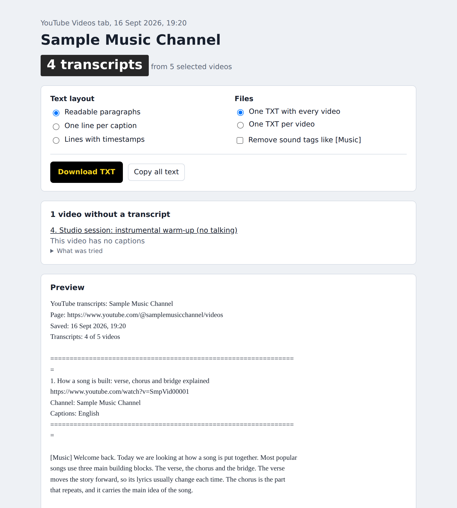
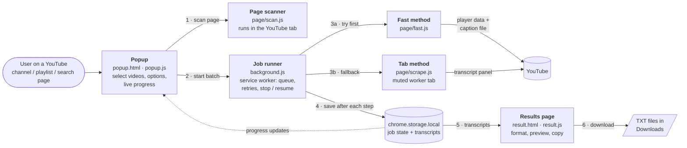
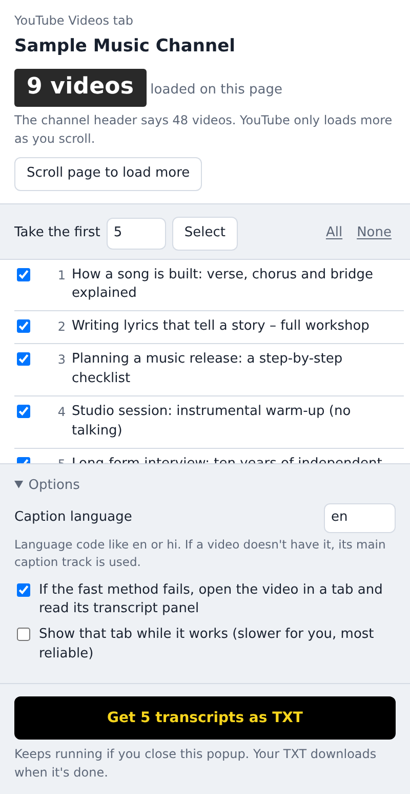
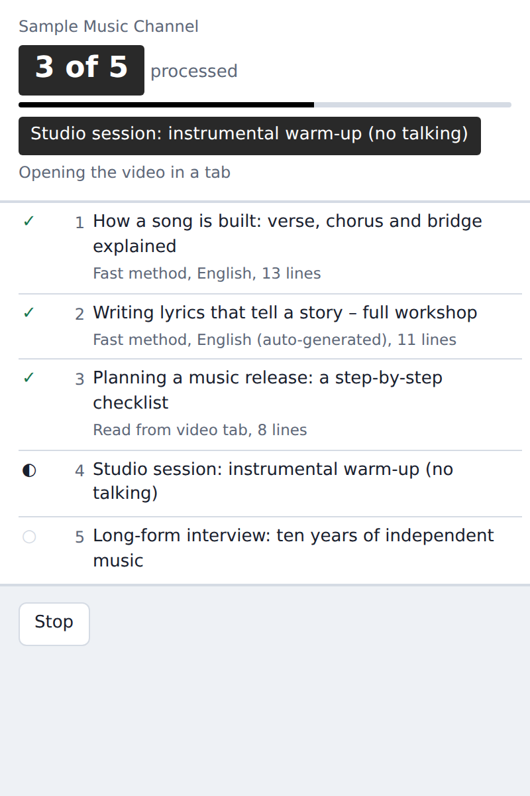
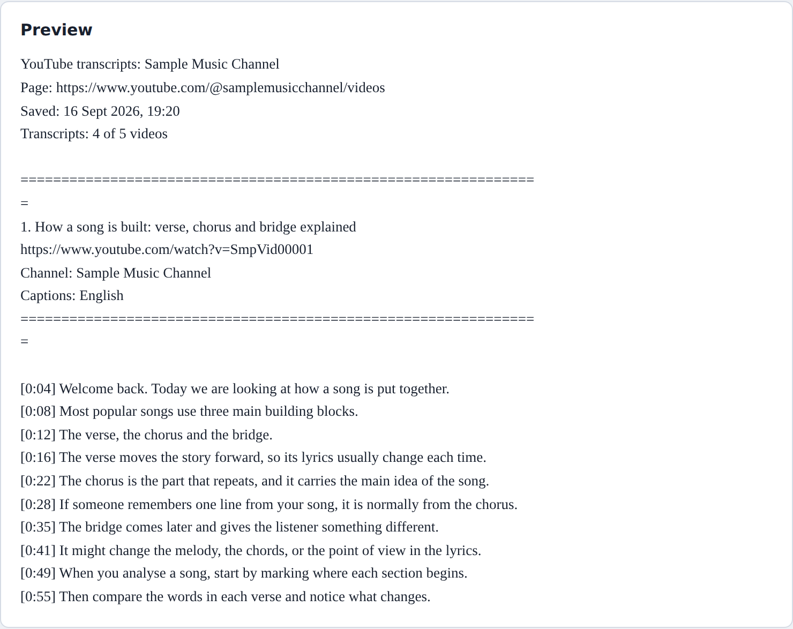

# Bulk Transcript Grabber – YouTube Transcript Copy Tool for Channels

A Chrome extension that collects the transcripts of many YouTube videos at once – from a channel, a playlist or a search results page – and saves them as clean, readable TXT files.



| | |
|---|---|
| **Type** | Browser extension (Chrome, Manifest V3) |
| **Language** | JavaScript, HTML, CSS – no frameworks, no build step, no third-party libraries |
| **Size** | About 1,700 lines of JavaScript and 560 lines of HTML/CSS |
| **Version** | 1.0.0 (September 2026) |
| **Runs** | Entirely in the user's browser – no server, no account, no API key |

---

## Contents

1. [Short description](#short-description)
2. [Problem statement](#problem-statement)
3. [Project objective](#project-objective)
4. [Key features](#key-features)
5. [How it works](#how-it-works)
6. [Technology stack](#technology-stack)
7. [System architecture and workflow](#system-architecture-and-workflow)
8. [Installation and setup](#installation-and-setup)
9. [Configuration](#configuration)
10. [Usage](#usage)
11. [Example workflow](#example-workflow)
12. [Screenshots](#screenshots)
13. [Project structure](#project-structure)
14. [Security considerations](#security-considerations)
15. [Limitations](#limitations)
16. [Future improvements](#future-improvements)
17. [Author and project ownership](#author-and-project-ownership)

---

## Short description

YouTube shows a transcript for one video at a time, and copying it means opening the video, finding the transcript panel and selecting the text by hand. This extension turns that into a batch job: the user opens a YouTube channel, playlist or search page, ticks the videos they want, and the extension works through the list in the background. When it finishes, it downloads every transcript as a TXT file and shows a results page with a preview, formatting options and a list of any videos that had no transcript.

## Problem statement

Long-form YouTube content holds a lot of useful information, but it is slow to review:

- **Long videos take too long to watch.** Interviews, workshops and tutorials often run for an hour or more. Reading or searching a transcript is much faster than watching the full video to find the key points.
- **Research across a whole channel is impractical by hand.** Understanding what a channel covers – its topics, repeated themes and style – would mean opening dozens of videos and copying each transcript individually.
- **Lyrics and spoken-word analysis needs text.** In music work, analysing song structure, wording or themes is easier when the captions are available as plain text rather than inside a video player.
- **Copied text is messy.** Text copied from YouTube's transcript panel comes with timestamps on separate lines and broken sentences, so it needs cleaning before it can be read or used elsewhere.

In practice this is useful for **content research**, **getting the key points from long-form videos without watching them in full**, **building an overview of a channel's content**, and **lyrics analysis**. The extension provides the text; reading, summarising or analysing that text is done by the user or with other tools.

## Project objective

Build a reliable, simple tool that:

1. Finds the videos already listed on a YouTube page and lets the user choose which ones to process.
2. Retrieves each video's transcript automatically, without the user having to open each video.
3. Keeps working if the popup is closed, and recovers if the browser pauses the extension.
4. Handles failures honestly – every video either produces a transcript or a clear reason why not.
5. Produces clean, readable output in the format the user needs.
6. Does all of this locally, without collecting data, requiring a login or storing any credentials.

## Key features

**Selecting videos**
- Detects the type of YouTube page (channel Videos / Shorts / Live tab, playlist, search results, feed or video page) and its name.
- Finds every video link on the visible page, in page order, with duplicates removed and Shorts labelled.
- Picks the best available title for each video from several possible page elements, ignoring labels such as durations, view counts and "Now playing".
- "Scroll page to load more" automatically scrolls the YouTube page to load more videos, and stops when no more videos appear.
- Quick selection: first *N* videos, all, none, or individual tick boxes.

**Retrieving transcripts**
- Two retrieval methods with automatic fallback (see [How it works](#how-it-works)).
- Preferred caption language setting (for example `en` or `hi`), with human-made captions preferred over auto-generated ones.
- Runs as a background job: the popup can be closed and the batch continues.
- Live progress: count, progress bar, current video, current step and a per-video status list.
- Stop (after the current video), Resume, and automatic detection of a batch that was interrupted.
- Rate-limit handling: if YouTube responds with HTTP 429 ("too many requests"), the extension waits 20 seconds and retries, and it adds a small random delay between videos.
- Detection of incomplete transcripts: if a transcript ends before the halfway point of a video longer than two minutes, it is flagged as possibly incomplete.

**Results and export**
- Results page opens automatically and the TXT download starts once, as soon as the batch finishes.
- Three text layouts: readable paragraphs, one line per caption, or lines with timestamps.
- One combined TXT file, or one TXT file per video in a dated folder.
- Option to remove sound tags such as `[Music]` and `♪`.
- "Copy all text" to the clipboard.
- Each transcript includes the video title and link, plus the channel name and caption language where available.
- A list of videos without a transcript, each with the reason and an expandable "What was tried" log.
- Settings and export preferences are remembered. Light and dark themes follow the operating system.

## How it works

For each selected video, the background job tries two methods in order.

### 1. Fast method (no video tab)

`src/page/fast.js` asks YouTube's player endpoint for the video's details, identifying itself as one of YouTube's app clients (Android VR, Android and iOS, tried in that order). The response lists the caption tracks available for the video. The extension:

1. Checks that the video is playable and that the response is for the requested video.
2. Chooses the best caption track by ranking the available tracks: an exact language match ranks highest, then the same base language (for example `en-GB` when `en` is requested), then any other language. Human-made captions rank above auto-generated captions in the same language.
3. Downloads the caption file in JSON format, falling back to XML if needed.
4. Parses it into a list of `[start time in ms, text]` segments, decoding HTML entities (including double-escaped ones YouTube sometimes returns).

If all three clients load the video and none reports a caption track, the video is marked "This video has no captions" straight away, without opening a tab.

The script runs inside the user's open YouTube tab where possible, and falls back to running inside the extension's background service worker if that tab has been closed.

### 2. Tab method (fallback)

If the fast method fails, `src/page/scrape.js` does what a person would do, automatically:

1. Opens the video in a single reusable, **muted** background tab.
2. Waits until the page for that specific video has loaded.
3. Finds and clicks YouTube's "Show transcript" button (expanding the description first if the button is hidden there).
4. Waits until the transcript panel stops adding lines, then reads every line and its timestamp. Both versions of the transcript panel that YouTube currently uses are supported.
5. Keeps the video paused while it works.

Background tabs sometimes do not draw the transcript panel. In that case the extension brings the tab to the front once, retries, and then returns focus to the tab the user was on. An option lets the user keep the tab visible for maximum reliability.

### Turning segments into readable text

`src/result.js` builds the output from the stored segments. The "readable paragraphs" layout joins caption lines into sentences and starts a new paragraph when a paragraph gets long and a sentence ends, when it exceeds a hard length limit, or when there is a pause of more than six seconds in the speech. File names are cleaned of characters that are not allowed in file systems.

## Technology stack

| Area | Technology |
|---|---|
| Platform | Chrome Extensions, **Manifest V3** |
| Language | Plain JavaScript (ES2020+), HTML5, CSS3 |
| Background processing | Extension **service worker** (`background.js`) |
| Page automation | `chrome.scripting.executeScript` (content scripts injected on demand), DOM querying |
| Network | `fetch` with `AbortController` timeouts |
| Data formats | JSON and XML caption files, parsed with custom parsers |
| Storage | `chrome.storage.local` (batch state and transcripts), `chrome.storage.sync` (user settings) |
| Output | `chrome.downloads` API with `Blob` URLs, Clipboard API |
| Tab control | `chrome.tabs` API (worker tab, focus management) |
| UI | Semantic HTML, CSS custom properties, `prefers-color-scheme` dark mode, `prefers-reduced-motion` |
| Dependencies | **None** – no npm packages, bundler or build step |

## System architecture and workflow

The popup, the background service worker and the results page communicate through Chrome messages and shared extension storage. Scripts in `page/` are injected into YouTube pages only when needed.



**Batch workflow**

```text
User opens a YouTube channel / playlist / search page
  → clicks the extension icon
  → popup injects scan.js and lists the videos found
  → user selects videos and clicks "Get N transcripts as TXT"
  → popup sends "start" to the background service worker
  → for each video, one at a time:
        fast method ──success──→ save transcript
            │ rate limited → wait 20 s → retry once
            │ all clients say "no captions" → mark as failed with reason
            ↓ other failure (and tab fallback enabled)
        tab method ───success──→ save transcript
            ↓ failure
        mark as failed with reason and a log of what was tried
        (short random pause before the next video)
  → results page opens and the TXT download starts
```

**Reliability design**

- **Job state is persisted** after every step, so the popup can be closed and reopened at any time and still show accurate progress.
- **Keep-alive and heartbeat:** Manifest V3 service workers can be stopped by Chrome when idle. During a batch the worker saves a heartbeat every 10 seconds. If the worker restarts and finds a "running" job with a heartbeat older than 45 seconds, it marks the job as *interrupted* so the user can resume it where it stopped.
- **Timeouts:** network requests (15 s), tab loading (40 s) and transcript reading (75 s) all have limits, so one bad video cannot freeze the batch.
- **Sequential processing** with random delays keeps request volume low and reduces the chance of being rate-limited.

More technical detail – message types, stored data and job states – is in [docs/architecture.md](docs/architecture.md).

## Installation and setup

**Requirements:** Google Chrome (desktop, a recent version). No other software is needed.

1. Download this repository:
   - **Option A:** click **Code → Download ZIP** on GitHub and unzip it, or
   - **Option B:** clone it:
     ```bash
     git clone https://github.com/LovepreetZ7/youtube-bulk-transcript-grabber.git
     ```
2. Open Chrome and go to `chrome://extensions`.
3. Turn on **Developer mode** (top-right switch).
4. Click **Load unpacked** and select the **`src`** folder inside the repository (the folder that contains `manifest.json`).
5. "Bulk Transcript Grabber" appears in the extensions list. Click the puzzle-piece icon in the toolbar and pin it for easy access.

To update after changing the code, click the reload icon on the extension's card in `chrome://extensions`.

## Configuration

**No environment variables, API keys, passwords or configuration files are required.** For that reason the repository has no `.env` or `.env.example` file.

All settings are set in the extension's own interface and saved in Chrome's synced extension storage:

| Setting | Where | Default | Purpose |
|---|---|---|---|
| Caption language | Popup → Options | `en` | Preferred caption language code, for example `en`, `hi`, `en-GB` |
| Tab fallback | Popup → Options | On | If the fast method fails, open the video in a tab and read the transcript panel |
| Show tab while it works | Popup → Options | Off | Keeps the worker tab visible – slower for the user, but the most reliable |
| Text layout | Results page | Readable paragraphs | Paragraphs, one line per caption, or lines with timestamps |
| Files | Results page | One combined TXT | One TXT with every video, or one TXT per video |
| Remove sound tags | Results page | Off | Removes tags such as `[Music]` and `♪` |

Permissions requested in `src/manifest.json` are explained under [Security considerations](#security-considerations).

## Usage

1. Open a YouTube page that lists videos, for example:
   - a channel's **Videos**, **Shorts** or **Live** tab (`youtube.com/@channel/videos`)
   - a **playlist** (`youtube.com/playlist?list=…`)
   - **search results** (`youtube.com/results?search_query=…`)
2. Click the **Bulk Transcript Grabber** icon. The popup lists the videos currently loaded on the page.
3. If the channel has more videos than are shown, click **Scroll page to load more**.
4. Choose the videos: type a number in **Take the first** and click **Select**, or use **All**, **None** or the individual tick boxes.
5. Optionally open **Options** to change the caption language or fallback behaviour.
6. Click **Get N transcripts as TXT**. You can close the popup; the batch continues in the background.
7. When the batch finishes, the results page opens and the TXT file downloads to `Downloads/YouTube Transcripts/`.
8. On the results page, change the layout or file options and click **Download TXT** again, or click **Copy all text**.

If Chrome pauses the extension during a long batch, reopen the popup and click **Resume**.

## Example workflow

**Goal:** get the key points from the latest long-form videos on a music education channel without watching them all.

1. Open the channel's **Videos** tab. The popup shows "YouTube Videos tab", the channel name and the number of videos loaded.
2. Enter **5** in *Take the first*, click **Select**, then **Get 5 transcripts as TXT**.
3. The progress view shows each video being processed. Most use the fast method; one video falls back to the tab method; one instrumental video has no captions.
4. The results page opens with **4 transcripts from 5 selected videos**, and one file is saved:

   ```text
   Downloads/YouTube Transcripts/Sample Music Channel - 4 transcripts - 2026-09-16 19.20.txt
   ```

5. The file begins like this (readable paragraphs layout):

   ```text
   YouTube transcripts: Sample Music Channel
   Page: https://www.youtube.com/@samplemusicchannel/videos
   Saved: 16 Sept 2026, 19:20
   Transcripts: 4 of 5 videos

   ================================================================
   1. How a song is built: verse, chorus and bridge explained
   https://www.youtube.com/watch?v=SmpVid00001
   Channel: Sample Music Channel
   Captions: English
   ================================================================

   [Music] Welcome back. Today we are looking at how a song is put together. ...
   ```

   and ends with a section listing the video that had no transcript and why.

6. The user can now read or search the text, or paste it into another tool to summarise it or analyse the lyrics and themes.

Full example files are in [`examples/`](examples/). The channel, videos and text in these examples are invented sample data.

## Screenshots

> The screenshots below show the real extension interface, captured in Chrome using invented sample data (not a real channel).

| Selecting videos on a channel page | Batch in progress |
|---|---|
|  |  |

**Results page** – summary, export options, videos without a transcript, and preview:


**Timestamped layout with sound tags removed:**



## Project structure

```text
youtube-bulk-transcript-grabber/
├── README.md                 Project overview (this file)
├── LICENSE                   Copyright notice – all rights reserved
├── .gitignore                Keeps secrets, packaged builds and system files out of Git
│
├── src/                      The Chrome extension (load this folder in Chrome)
│   ├── manifest.json         Extension name, version, permissions, entry points
│   ├── background.js         Service worker: job queue, retries, fallback, stop/resume, keep-alive
│   ├── popup.html            Popup layout: select videos, options, progress
│   ├── popup.js              Popup logic: page scan, selection, messaging, live progress
│   ├── popup.css             Popup styles
│   ├── result.html           Results page layout
│   ├── result.js             Text formatting, preview, TXT download, copy, failed-video list
│   ├── result.css            Results page styles
│   ├── ui.css                Shared styles and light/dark colour theme
│   ├── icons/                Extension icons (16, 32, 48, 128 px)
│   └── page/                 Scripts injected into YouTube pages
│       ├── scan.js           Finds video links and page details; auto-scroll to load more
│       ├── fast.js           Fast method: player endpoint, caption track choice, JSON/XML parsing
│       └── scrape.js         Tab method: opens the transcript panel and reads its lines
│
├── docs/
│   └── architecture.md       Messages, stored data, job states and failure handling
│
├── screenshots/              Interface screenshots used in this README
│
└── examples/                 Example TXT outputs in each format (sample data)
```

## Security considerations

- **No secrets in the code or repository.** The extension needs no API key, password, token or login. It does not store a YouTube API key: when it runs inside a YouTube tab it reuses the public configuration that the YouTube page itself provides; otherwise it sends the request without a key.
- **No server and no tracking.** There is no backend, analytics or third-party service. The only network requests go to `youtube.com` and the caption file links YouTube returns.
- **User cookies are not sent by the fast method.** Requests to the player endpoint and caption files use `credentials: 'omit'`, so the user's YouTube login session is not attached to these requests. (The tab method opens a normal YouTube page, exactly as the user's browser would.)
- **Limited permissions.** Host access is restricted to `https://www.youtube.com/*`. Other permissions and why they are needed:

  | Permission | Why it is needed |
  |---|---|
  | `activeTab`, `scripting` | Read the list of videos from the YouTube page the user is on, and read the transcript panel in the worker tab |
  | `storage`, `unlimitedStorage` | Save batch progress and transcripts locally so the job survives the popup closing; long batches can exceed the default storage quota |
  | `downloads` | Save the TXT files to the Downloads folder |

- **Safe handling of page content.** Video titles and transcript text come from YouTube and are treated as untrusted. The interface inserts them with `textContent` and `createElement` only – the code does not use `innerHTML` or `eval` – which prevents injected HTML or scripts from running in the extension's pages.
- **Safe file names.** Characters that are invalid or dangerous in file paths (such as `/ \ : * ? " < > |` and control characters) are removed from titles before they are used as file names.
- **External links** on the results page open with `rel="noopener"`.
- **Data stays local and short-lived.** Transcripts are stored only in the browser's extension storage, and the previous batch is deleted when a new batch starts.
- **Repository hygiene.** `.gitignore` excludes `.env` files, keys, cookies, packaged builds (`.zip`, `.crx`), downloaded transcripts, logs and operating-system files. The repository was checked for exposed credentials before publishing.

## Limitations

- **Relies on YouTube's internal behaviour.** The fast method uses YouTube's undocumented player endpoint, and the tab method depends on the structure of YouTube's web page. If YouTube changes either, parts of the extension may stop working until the code is updated. The official YouTube Data API was not used because its caption download requires the user to sign in with OAuth and have permission for the video, which does not suit research on other channels.
- **Only videos with captions.** The extension reads existing captions (human-made or auto-generated). It does not perform speech-to-text, so videos without captions – such as many instrumental or music-only videos – produce no transcript.
- **Only videos loaded on the page.** YouTube loads channel videos gradually as the page scrolls. The extension processes the videos currently loaded; very large channels need several "load more" rounds.
- **One video at a time.** Processing is sequential on purpose, to avoid YouTube rate limits. Large batches take time, especially when the tab method is used.
- **Language choice is a preference, not a translation.** If a video does not have the requested language, its main caption track is used instead.
- **Restricted videos may fail.** Private, members-only or age-restricted videos may not return captions.
- **Only the latest batch is kept.** Starting a new batch replaces the previous results.
- **Browser support.** Built for Google Chrome on desktop and installed as an unpacked extension (developer mode). It is not published on the Chrome Web Store.
- **No automated test suite.** The parsing functions are exposed internally for testing, but the repository does not currently include automated tests.
- **Responsible use.** Transcripts belong to the video creators. Users are responsible for using the text in line with YouTube's Terms of Service and copyright law.

## Future improvements

These are ideas for future versions and are **not** part of the current project:

- Automated unit tests for the caption parsers, track selection and text formatting.
- More export formats, such as SRT subtitles, CSV or JSON.
- A history of previous batches instead of keeping only the latest one.
- Options to filter videos by date, duration or title keywords before processing.
- An optional step to summarise transcripts or extract key points after download.
- Automatic handling of the "load more" step for an entire channel.
- Packaging for the Chrome Web Store.

## Author and project ownership

**Author:** Lovepreet Singh ([@LovepreetZ7](https://github.com/LovepreetZ7))
**Organisation:** Raptuner Distribution Private Limited
**Built:** September 2026

### What I built

I designed and built this extension, including:

- **The overall architecture** – splitting the work between the popup, a background service worker, injected page scripts and a separate results page, and the message protocol and storage model that connect them.
- **The page scanner** – detecting the page type, finding video links and choosing reliable titles from YouTube's changing page layout, plus automatic scrolling to load more videos.
- **The two-method retrieval pipeline** – the fast method with caption track selection and JSON/XML parsing, and the tab method that automates YouTube's transcript panel, with automatic fallback between them.
- **Reliability and error handling** – persisted job state, keep-alive and interruption detection, stop and resume, timeouts, rate-limit waiting and retry, incomplete-transcript detection and per-video failure reasons.
- **The text processing and export** – the paragraph-building logic, three output layouts, sound-tag removal, safe file naming, combined and per-video downloads, and copy to clipboard.
- **The user interface** – popup and results page, including live progress and light/dark themes.
- **Security review for public release** – limited permissions, safe DOM handling, and removal of hard-coded keys.

---

© 2026 Raptuner Distribution Private Limited. All rights reserved. No licence granted. See [LICENSE](LICENSE).

This project is not affiliated with, endorsed by, or sponsored by YouTube or Google.
